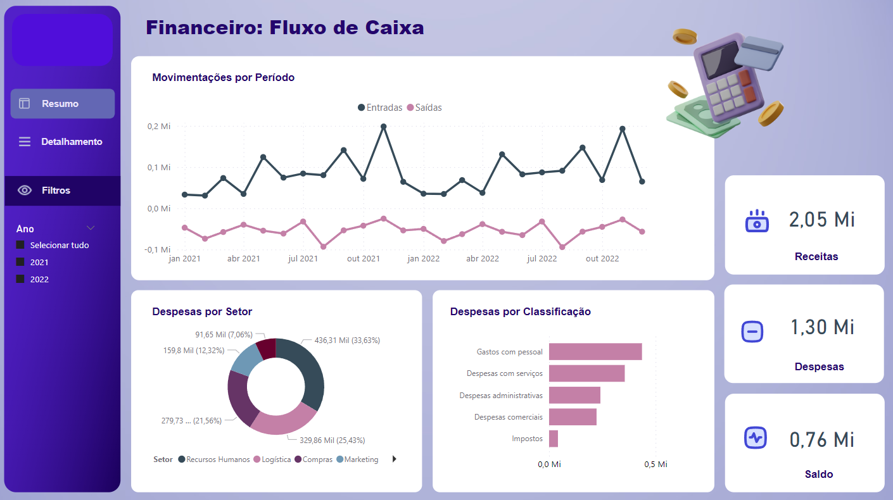
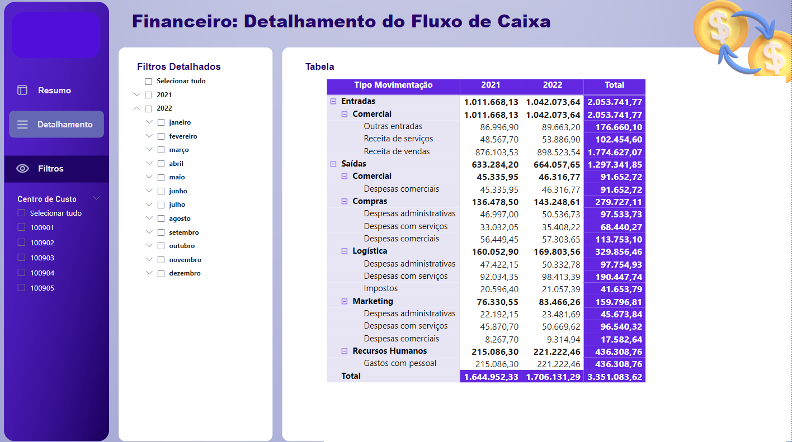

# 📊 PBI - FluxoCaixa

O Dashboard criado teve como objetivo atender a demanda de negócio com base de dados fictícios a fim de praticar conceitos estudados:

#### 🧪 Perguntas de Negócio:

1- Qual o total de Receitas e Despesas o Saldo do Caixa por ano.
2- Qual o total de Entradas e Saídas de acordo com a linha do tempo.
3- Como estão distribuídas as despesas por detalhe de cada setor.
4- Como as despesas foram realizadas conforme a classificação.
5- Visualizar dados em forma de tabela, com filtros.
    
    
#### ⚙️ Recursos e Funcionalidades Exploradas:

- Utilizando Filtros
- Explorando Gráficos linha, pizza, barras empilhadas.
- Criando botões de Navegação

#### 🧰 Dashboard:

#### 💻 Link PowerBI
[Fluxo de Caixa](https://app.powerbi.com/links/y3hI6Oq4kE?ctid=ab92b966-4489-4c22-9fc6-1535db65d26f&pbi_source=linkShare)
